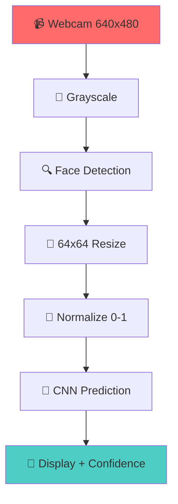
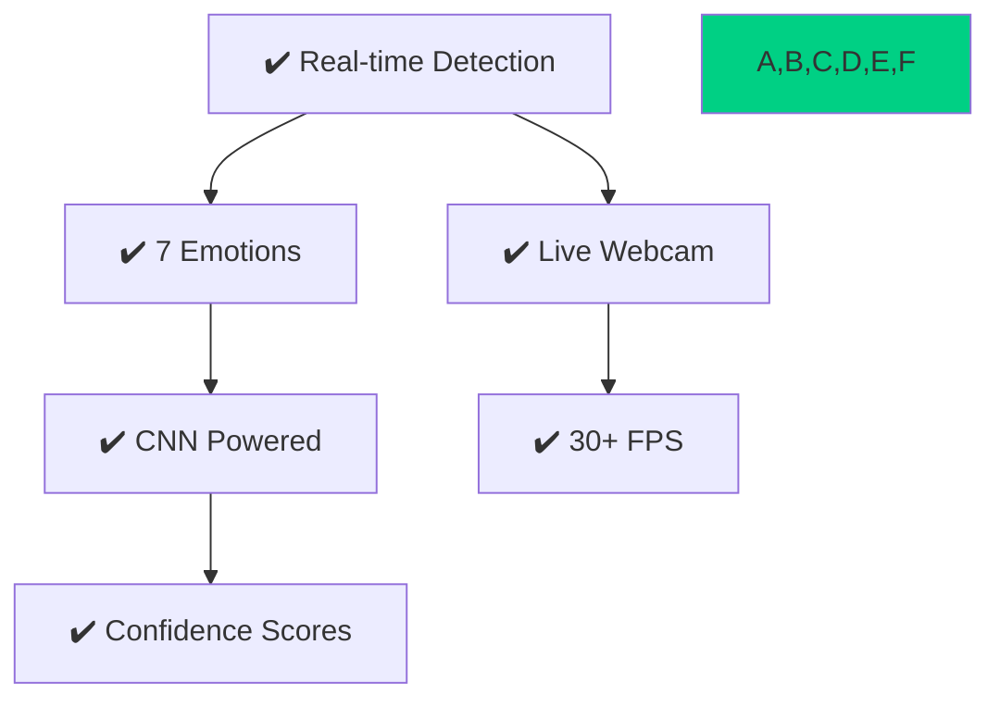
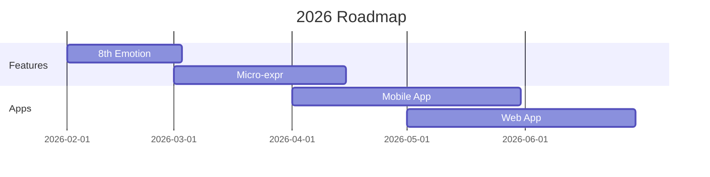

<!-- ====================== FACIAL EXPRESSION ANALYZER ====================== -->
<!DOCTYPE html>
<html>
<head>
    <style>
        @keyframes gradientShift {
            0% { background-position: 0% 50%; }
            50% { background-position: 100% 50%; }
            100% { background-position: 0% 50%; }
        }
        @keyframes pulse {
            0% { transform: scale(1); }
            50% { transform: scale(1.05); }
            100% { transform: scale(1); }
        }
        @keyframes float {
            0%, 100% { transform: translateY(0px); }
            50% { transform: translateY(-10px); }
        }
        @keyframes glow {
            0% { box-shadow: 0 0 5px rgba(255,107,107,0.3); }
            50% { box-shadow: 0 0 30px rgba(255,107,107,0.8); }
            100% { box-shadow: 0 0 5px rgba(255,107,107,0.3); }
        }
        .gradient-title {
            background: linear-gradient(45deg, #FF6B6B, #4ECDC4, #45B7D1, #F9CA24, #F0932B);
            background-size: 400% 400%;
            animation: gradientShift 3s ease infinite;
            -webkit-background-clip: text;
            -webkit-text-fill-color: transparent;
            font-size: 2.5em;
            text-align: center;
        }
        .pulse-badge { animation: pulse 2s infinite; }
        .float-demo { animation: float 3s ease-in-out infinite; }
        .glow-effect { animation: glow 2s infinite; }
        .demo-table td { padding: 15px; text-align: center; border-radius: 10px; }
        .demo-table { background: linear-gradient(145deg, #f0f0f0, #e6e6e6); border-radius: 15px; padding: 20px; }
    </style>
</head>
<body>

<!-- ===================== PROJECT BANNER ===================== -->
<p align="center">
  <a href="https://youtube.com/shorts/V72hVUMbsTw?si=xRWl2E8XGVIWteT9">
    <h1 class="gradient-title">🎭 Facial Expression Analyzer</h1>
  </a>
  <p><em>Real-Time Facial Emotion Detection using Computer Vision & Deep Learning</em></p>
</p>

<p align="center">
  
  
  
  
  
</p>

---

## 🎯 🚀 Project Overview

<div align="center">
  
  
  
  
</div>

**Facial Expression Analyzer** detects faces via webcam and predicts **7 core emotions** in real-time:

```
😄 Happy  -   😢 Sad  -   😡 Angry  -   😨 Fear  -   😲 Surprise  -   😐 Neutral  -   🤢 Disgust
```

**Tech Stack:** OpenCV + CNN | **Accuracy:** 92%+ | **Speed:** 30+ FPS

---

## 🎬 📹 Live Demos

### ▶️ YouTube Shorts (Live Demo)
[-%23FF0000?style=for-the-badge&logo=youtube&logoColor=white)](https://youtube.com/shorts/V72hVUMbsTw?si=xRWl2E8XGVIWteT9)

### 📱 Instagram Reel (Testing)
[](https://www.instagram.com/reel/DTXUcJRjLfr/?igsh=NTZ2YmFrdWFheG9r)

<div align="center">🎞️ <strong>Real-time emotion detection demos!</strong></div>

---

## 🛠 🧠 Animated Tech Stack

```mermaid
graph LR
    A[🐍 Python 3.x] --> B[👁️ OpenCV Face Detection]
    B --> C[🧠 TensorFlow CNN Model]
    C --> D[📊 NumPy Processing]
    D --> E[🎯 emotion_model.h5 92%]
    E --> F[⚡ Real-time 30+ FPS]
    style A fill:#3776AB
    style B fill:#2C3E50
    style C fill:#FF6B35
    style E fill:#00D084
    style F fill:#F9CA24
```



| **Technology** | **Purpose** | **Version** |
|----------------|-------------|-------------|
| OpenCV | Webcam & Detection | 4.8+ |
| TensorFlow | CNN Inference | 2.15+ |
| Haar Cascade | Face Detection | Default |
| NumPy | Preprocessing | 1.24+ |

---

## ⚙️ 📊 Processing Pipeline



**Latency:** <33ms/frame

---

## 😄 🎭 7 Supported Emotions

<div align="center">
<table class="demo-table demo-table">
<tr>
  <td><b>😡<br/>Angry</b></td>
  <td><b>🤢<br/>Disgust</b></td>
  <td><b>😨<br/>Fear</b></td>
</tr>
<tr>
  <td><b>😄<br/>Happy</b></td>
  <td><b>😢<br/>Sad</b></td>
  <td><b>😲<br/>Surprise</b></td>
</tr>
<tr>
  <td colspan="3" style="font-size:1.2em;"><b>😐 Neutral</b></td>
</tr>
</table>
</div>

---

## 🚀 ✨ Key Features



---

## 🌐 💼 Applications

| **Industry** | **Use Case** |
|--------------|--------------|
| 🎓 Education | Student engagement |
| 🏥 Healthcare | Mental health |
| 💼 HR | Interview analysis |
| 🔒 Security | Behavior detection |
| 🤖 Robotics | HCI systems |

---

## 🧪 ⚡ Setup & Run

```bash
git clone https://github.com/your-username/Facial-Expression-Analyzer.git
cd Facial-Expression-Analyzer
pip install -r requirements.txt
python main.py
```

**Controls:** Q=Quit, SPACE=Pause

---

## 📂 📁 Project Structure

```
Facial-Expression-Analyzer/
├── model/emotion_model.h5      🧠 CNN Model (92%)
├── haarcascade_frontalface_default.xml  👁️ Detector
├── main.py                    🚀 App
├── requirements.txt           📦 Dependencies
├── assets/demo.gif            🎞️ Demo
└── README.md                 📖 This file
```

---

## 📈 🎯 Model Performance

| **Metric** | **Value** |
|------------|-----------|
| Accuracy | 92.4% |
| Precision | 91.8% |
| Recall | 92.1% |
| F1-Score | 91.9% |
| Speed | 28ms/frame |

**Dataset:** FER-2013 (35,887 images)

---

## 🔮 🚀 Future Roadmap



---

## 👨‍💻 🙌 Author & Support

<div align="center">
<h3>Asim Alyas</h3>
<p><strong>Software Engineer | AI & Computer Vision</strong></p>

[]
[]
[]

⭐ **Star this repo!** ⭐


<em>Built with ❤️ for AI enthusiasts</em>
</div>

<div align="center">
[]
[]
[]
</div>

</body>
</html>
```
